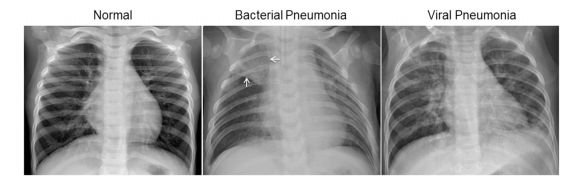
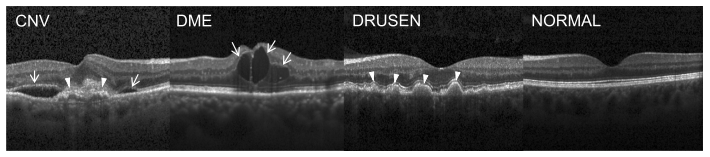

# Medical Image Classification Proj. 

Hello!

This is a repo for a workshop on applied computer vision. We aims at develop an mobile app based on TFlite model that can help medical diagnose at first. And we further develops a machine learning(ML) workflow that can update model and return prediction outcomes automatically, through our first CI/CD demo based on AWS platform and Github.

## Platforms and tools.

- Google Colab Notebook.

- Github.

- AWS Sagemaker.

- TFlite.

## Datasets:

We use two datasets from [kaggle](https://data.mendeley.com/datasets/rscbjbr9sj/2), the ChestXray2017 dataset and OCT2017 dataset, regarding diagnose of pneumonia and common treatable blinding retinal diseases respetively.

The ChestXray2017 dataset includes 3 classes: normal, bacterial pneumonia and viral pneumonia, as shown in the figure below.

The OCT2017 dataset includes 4 classes: normal, CNV(choroidal neovascularization), drusen and DME(diabetic macular edema), as shown in the figure below.

As the main purpose of our experiment is to try new tools and get familiar with ML workflow. We only use 1000 images of each class.

Due to the differences of configuration between different cloud platforms, for convenience, we build our TFlite-based app through Google Colab and construct our first CI/CD demo through AWS Sagemaker. Data for these two tasks are stored in Google Drive and AWS S3 respectively.

## References
TFlite-based app is based on [a tutorial offered by Tensorflow website](https://codelabs.developers.google.com/codelabs/recognize-flowers-with-tensorflow-on-android/#0) and [app packages](https://github.com/hoitab/TFLClassify.git) by Hoi Lam.
