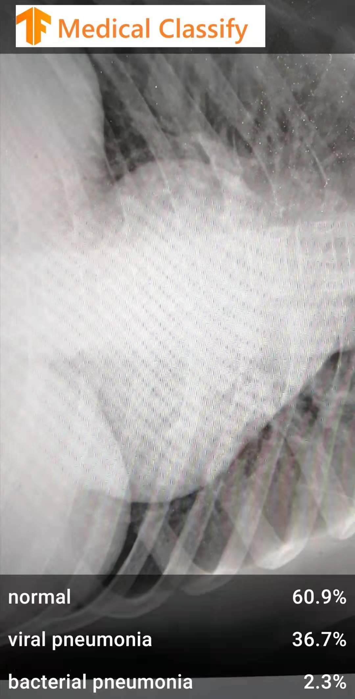
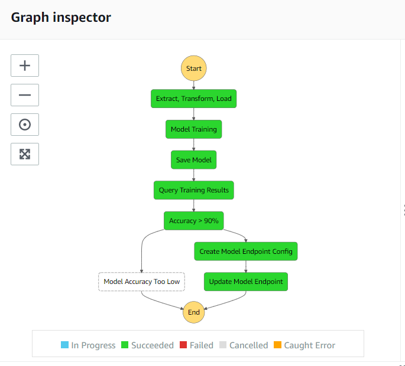

# Medical Image Classification Experiment

Hello!

This is a repo for a workshop on applied computer vision. We aims at develop an mobile app based on TFlite model that can help medical diagnose at first. And we further develops a machine learning(ML) workflow that can update model and return prediction outcomes automatically, through our first CI/CD demo based on AWS platform and Github.

## Platforms and tools.

- Google Colab Notebook.

- Github.

- AWS Sagemaker.

- TFlite.

## Datasets:

We use two datasets from [kaggle](https://data.mendeley.com/datasets/rscbjbr9sj/2), the ChestXray2017 dataset and OCT2017 dataset, regarding diagnose of pneumonia and common treatable blinding retinal diseases respetively.

The ChestXray2017 dataset includes 3 classes: normal, bacterial pneumonia and viral pneumonia, as shown in the figure below.

The OCT2017 dataset includes 4 classes: normal, CNV(choroidal neovascularization), drusen and DME(diabetic macular edema), as shown in the figure below.

As the main purpose of our experiment is to try new tools and get familiar with ML workflow. We only use 1000 images of each class.

Due to the differences of configuration between different cloud platforms, for convenience, we build our TFlite-based app through Google Colab and construct our first CI/CD demo through AWS Sagemaker. Data for these two tasks are stored in Google Drive and AWS S3 respectively.

## Task 1 Develop an android app customized by new model

The procedure of task 1 is straightforeward.

- Step 1: upload images into your Google Drive, with images of the same labels in the same folder and the label as folder's name.
- Step 2: mount your data to your Colab and run the [notebook](Notebooks/Medical_Classification_with_TFLite_Model_Maker.ipynb) to train a model, with model with ".tflite" format as output. 
- Step 3: set up the skeleton app in your Android Studio.
- Step 4: [load the model](Images/Load_model.PNG) in to the "start" part of the app.
- Step 5: customize the "MainActivity.kt" file [labeled with TODO](Images/TODO.PNG) by the app author, you may need to change the codes under each "TODO" according to your model, and import your model.
- Step 6: run you app with a virtual device or with your own android phone, you need to authorize USB debugging in your phone.
- Step 7: you can further design your UI in [layout, drawable and ic_launcher](Images/UI.PNG). 

The figure below is our demo interface. As the app use camera, the app is actually not so good as its model's accuracy (generally > 90%). We may update it in the future.

 

We have train 4 models, "pn_model.tflite" and "pn_sub_model.tflite" are for ChestXray2017 dataset, with the latter account for subclass of pnenmonia. The "oct.tflite" and "oct_sub.tflite" are similar. You can check them in the folder Models.

## Task 2 Construct a CI/CD demo for ML based on Sagemaker and Github

Diagnose based on medical images may not be enough reliable and popularized nowadays, but it's promissing that ML may help the medical field a lot. Automatic image classification can assist doctors who may be overwhelmed a large amout of cases everyday, to make a decision quickly and avoid diagnose. And machine may even do better than human on some diseases. 

We can assume that our ML model will face routine tasks as in many other ML usage scenarios, involving data drift and version control. In our first step of CI/CD, we want to build an semi-automatic workflow which can retain model with neweast data and return output automatically. 

The procedure of task 2 is as follows:
- Step 1: we use AWS S3 bucket to store our data, including data for model training, testing and unlabeled data from a prediction task.
- Step 2: we use Github to host our codes.
- Step 3: create a [Git Repo](Images/GitRepo.PNG) under AWS SageMaker with Personal access tokens as password of AWS secret.
- Step 4: create a Notebook instance under AWS SageMaker with an "AmazonSageMaker-ExecutionRole"(you can create a new one), linking to the above Git Repo.
- Step 5: give the "AmazonSageMaker-ExecutionRole" above IAM "Read" pemissions. You can check the "setup" notebook for reference, while the parts for Glue job and Lambda function is for task 3.
- Step 5: run the [Notebook](Notebooks/Medical_Classification_with_SageMaker_TF.ipynb) for model traing, deploying and prediction. The notebook will download data from S3, process it (generate annotation file and split the dataset) and upload back to S3. The training will be handled by SageMaker. We advice you to use the "conda_amazonei_tensorflow2_p36" kernel for this task, as the training is based on pretrained tensorflow models. The "train.py" file will be generated by the notebook as the entry point of training, you can change parameters in that part of codes. When the training procedure succeeds, you can deploy it and test with test data picked from S3 test dataset. You can run the prediction task part to get a list of labels for the pictures you want to label, the output will return to both S3 and [Github](MedicalImage/Pneumonia/task/prediction_output.txt) as txt file.
- Step 6: you can delete the endpoint when the you don't need the model.

The current accuracy of task 2 is a bit lower than task 1, we have tuned it a lot but didn't improve much. We will try more pretrained models in the future.

## Task 3 Build a Step function workflow with AWS Step Functions SDK
We are trying to use AWS Step Functions SDK to automatic the training to deploying process with one click, integrating Glue job and Lambda function. We want to use Glue job to simplify data preparation, and use Lambda function to add a condition (e.g. accuracy threshold) for model deploy.

Our target workflow is to realize the following workflow for image classification.

 

We haven't closed this task in current stage. We will update it later.

## References
- Task 1 is based on [a tutorial offered by Tensorflow website](https://codelabs.developers.google.com/codelabs/recognize-flowers-with-tensorflow-on-android/#0) and [the skeleton app packages](https://github.com/hoitab/TFLClassify.git) by Hoi Lam.
- Task 2 is based on a [project in coursera](https://github.com/maulikpokiya/Machine-Learning/tree/58a7fb3335ac734f6cf76b2536e4e4ffcdfc44a4/Coursera%20TensorFlow%20with%20Sagemaker).
- Task 3 is based on a [sagemaker example with step function](https://github.com/Macyatmacy/amazon-sagemaker-examples/tree/master/step-functions-data-science-sdk/automate_model_retraining_workflow).

## Group Members
Macy and Yuhan
